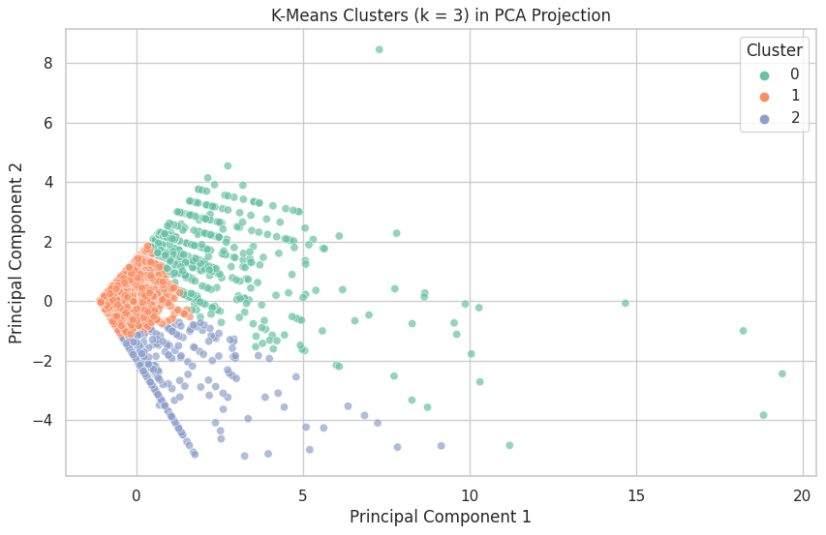
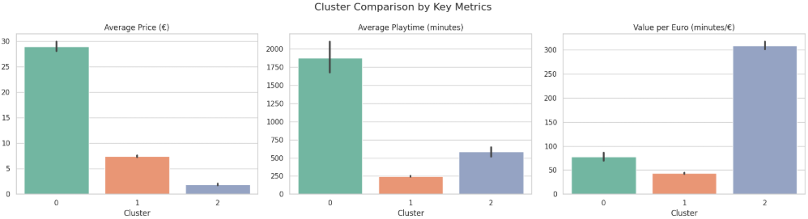

# 🕹️ Best Value Steam Games

This project explores **which Steam games offer the most value for money** by analyzing over 27,000 titles using **unsupervised learning (PCA + K-Means)**.

We cluster games based on:

- 💰 **Price**
- ⏱️ **Average Playtime**
- 💎 **Value per Euro** *(playtime per euro spent)*

---

## 🧠 Goal

> Discover which games are **cheap but engaging**, which are **overpriced and underplayed**, and which fall somewhere in between — all through data.

---

## 📁 Dataset

Steam Store Games — [Kaggle Dataset](https://www.kaggle.com/datasets/nikdavis/steam-store-games)

---

## ⚙️ Tools & Libraries

- Python, Pandas, NumPy
- Scikit-learn (PCA, KMeans, Silhouette Score)
- Seaborn, Matplotlib
- Jupyter / Kaggle Notebooks

---

## 📊 PCA Cluster Projection

Games grouped into 3 clusters using K-Means and visualized with PCA:

---

## 📈 Cluster Comparison by Key Metrics

Average stats per cluster (price, playtime, and value per euro):

---

## 🧠 Cluster Summary

| Cluster | Description                    | Avg. Price | Avg. Playtime | Value per € |
|---------|--------------------------------|------------|----------------|-------------|
| 0       | 💰 Premium (high price, long playtime) | €28.91     | 1,874 min       | 77.5         |
| 1       | 😐 Low-retention games          | €7.43      | 244 min         | 43.6         |
| 2       | 💎 Best value indie gems        | €1.89      | 582 min         | 309.2        |

---

## 🏆 Notable High-Value Titles

Some popular games that made it into the best-value cluster:

- ✅ **The Elder Scrolls V: Skyrim**
- ✅ **Arma 2: Operation Arrowhead**
- ✅ **The Madness of Little Emma**
- ✅ **RACE 07**

---

## 📓 Notebook

🔗 Check out the full analysis in the interactive notebook on **Kaggle**:  
👉 [Best Value Steam Games — Clustering Analysis](https://www.kaggle.com/code/davidmartimar/best-value-steam-games-clustering)

---

## ✅ Conclusion

This project shows how clustering and simple feature engineering can reveal meaningful insights about pricing, engagement, and value in digital marketplaces.

Next steps could include:
- Integrating review scores and sentiment
- Filtering by genre
- Creating a recommender based on value clusters

---

## 🙋‍♂️ Author

Made with data, curiosity and a little obsession for **Steam deals** 🎮  
Connect with me on [LinkedIn](https://www.linkedin.com/in/davidmartimar/).
